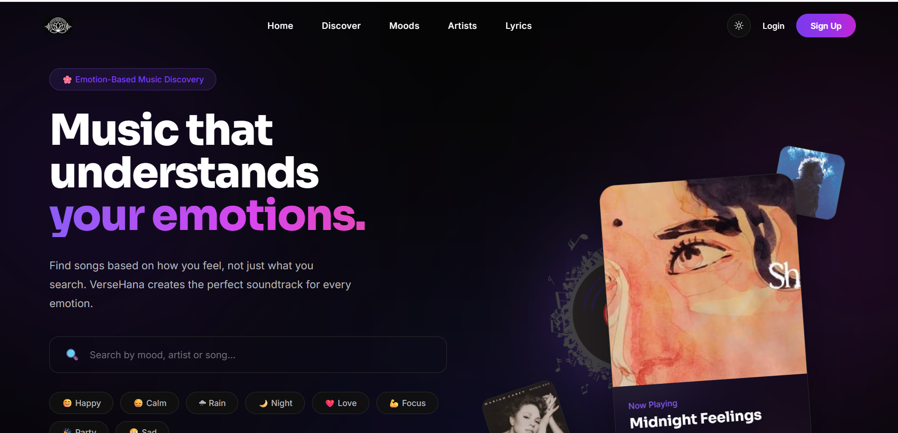

<div align="center">


<h3>Building ideas into experiences ✦</h3>

<p>
  <a href="https://github.com/rmanikk">
    
  </a>
  <a href="https://linkedin.com/in/rm4nik">
    
  </a>
  <a href="mailto:manikkafle.com.np@gmail.com">
    
  </a>
</p>

</div>

---

## ✦ About Me

<table>
<tr>
<td width="55%" valign="top">

### Hey, I'm Manik 👋

I'm a **Software Engineer** who enjoys turning ideas into practical, polished digital experiences.

I like working across the stack — from designing interfaces and user experiences to building the backend systems that power them.

<br>

**Currently**

🔭 Building **[Verse-Hana](https://github.com/rmanikk/Verse-Hana)**
🌱 Exploring **Full-Stack Development**
🎨 Interested in **UI/UX & Product Design**
💡 Always experimenting with new ideas

</td>

<td width="45%" valign="top">

### ⚡ Quick Facts

```text
▸ Role       Software Engineer
▸ Focus      Full-Stack Development
▸ Interest   UI/UX & Product Design
▸ Building   Verse-Hana
▸ Location   Nepal 🇳🇵
```

</td>
</tr>
</table>

---

<div align="center">

## 🚀 Currently Building

### 🎵 Verse-Hana

**A modern music platform built from the ground up.**

</div>

<table>
<tr>
<td width="50%" valign="top">

### What I'm building

🎧 Music discovery & exploration
🎵 Modern music-player experience
👤 Authentication & user accounts
📊 User activity & personalization
🎨 Responsive and intuitive UI
⚙️ Full-stack architecture

</td>

<td width="50%" valign="middle" align="center">

<a href="https://github.com/rmanikk/Verse-Hana">



</a>

<br><br>

<a href="https://github.com/rmanikk/Verse-Hana">

</a>

</td>
</tr>
</table>

---

<div align="center">

## 📊 GitHub At A Glance

<br>


</div>

<br>

<div align="center">


</div>

---

## 📈 Contribution Journey

<div align="center">


</div>

---

## 🛠️ Tech Stack

<div align="center">

### Languages

<p>

</p>

### Frontend

<p>

</p>

### Backend & Database

<p>

</p>

### Tools & Cloud

<p>

</p>

### Data & Machine Learning

<p>

</p>

</div>

---

<div align="center">

## 🌐 Let's Connect

<br>

<a href="https://linkedin.com/in/rm4nik">

</a>

<a href="https://instagram.com/slacker_m4nik">

</a>

<a href="https://dribbble.com/rmanik">

</a>

<a href="mailto:manikkafle.com.np@gmail.com">

</a>

<br><br>


</div>

---

<div align="center">

### ✦ Keep building. Keep learning. Keep shipping. ✦

<br>


</div>
